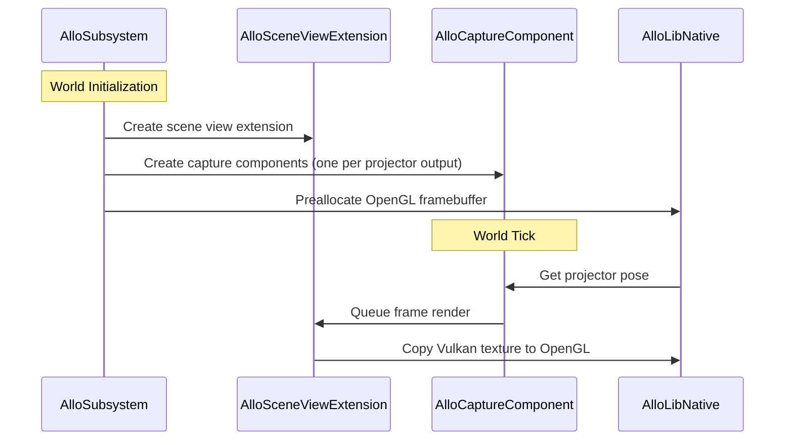

```mermaid
sequenceDiagram
    participant S as AlloSubsystem
    participant SVE as AlloSceneViewExtension
    participant CC as AlloCaptureComponent
    participant N as AlloLibNative
    
    note over S: World Initialization
    S->>SVE: Create scene view extension
    S->>CC: Create capture components (one per projector output)
    S->>N: Preallocate OpenGL framebuffer
    
    note over CC: World Tick
    N->>CC: Get projector pose
    CC->>SVE: Queue frame render
    SVE->>N: Copy Vulkan texture to OpenGL
    
```